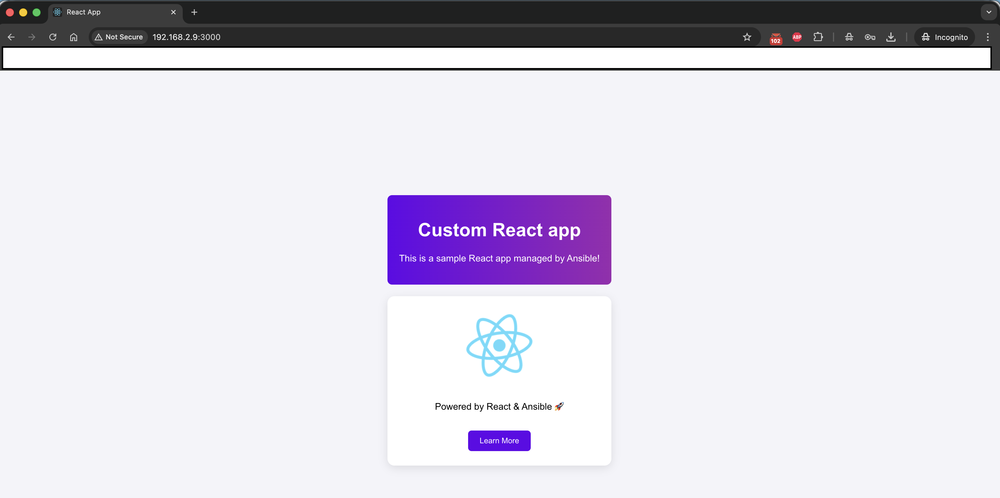

# ansible-mern-stack

Public Ansible role and playbooks to provision a MERN web tier (Node.js + React).  
It installs Node.js, scaffolds a React app, optionally templates a custom UI, and runs the dev server with PM2.

---

## Final Result Should be

<p align="center">
  
</p>

---

## What this does

- Installs Node.js and npm (`apt`).
- Creates the app dir: `{{ app_dir }}`.
- Installs global npm packages from `npm_packages` (via `community.general.npm`).
- Initializes React with `npx create-react-app {{ app_name }}` (idempotent).
- Binds dev server to `0.0.0.0` via `.env` (`HOST=0.0.0.0`).
- If `deploy_custom_page: true`: templates `App.js.j2` and copies `App.css`.
- Starts the app with PM2.

---

## Prerequisites

- Ansible core ≥ 2.14.
- Collections:
  ```bash
  ansible-galaxy collection install community.general community.crypto
  ```
- Debian/Ubuntu hosts (uses `apt`).
- Inventory group `webservers`.

---

## Inventory and vars

`inventory/hosts`
```ini
[webservers]
webserver01 ansible_host=YOUR_IP
```

`group_vars/webservers.yaml`
```yaml
deploy_custom_page: true
react_app:
  title: "Custom React app"
  message: "This is a sample React app managed by Ansible!"
```

Optional global defaults (already in role):
```yaml
app_dir: "/var/www/mern-app"
app_name: "my_app"
npm_packages: [express, create-react-app, pm2]
```

---

## Quick start

```bash
ansible-playbook -i inventory/hosts main-playbook.yml
```

Then open: `http://<webserver_ip>:3000/`.

---

## Project structure (excerpt)

```
├── ansible.cfg
├── group_vars
│   ├── all.yaml
│   ├── README_group_vars.md
│   └── webservers.yaml
├── images
├── inventory
│   └── hosts
├── main-playbook.yml
└── roles
    ├── common
    │   ├── defaults
    │   │   └── main.yml
    │   ├── files
    │   ├── handlers
    │   │   └── main.yml
    │   ├── meta
    │   │   └── main.yml
    │   ├── README.md
    │   ├── tasks
    │   │   └── main.yml
    │   ├── templates
    │   ├── tests
    │   │   ├── inventory
    │   │   └── test.yml
    │   └── vars
    │       └── main.yml
    └── webserver
        ├── defaults
        │   └── main.yml
        ├── files
        │   └── App.css
        ├── handlers
        │   └── main.yml
        ├── meta
        │   └── main.yml
        ├── README.md
        ├── tasks
        │   └── main.yml
        ├── templates
        │   └── App.js.j2
        ├── tests
        │   ├── inventory
        │   └── test.yml
        └── vars
            └── main.yml


```

---

## Add the screenshot to this README

1) Save your screenshot as `images/web-result.png` inside `ansible-mern-stack/`.  
2) Commit:
```bash
mkdir -p images
# put your PNG in images/web-result.png
git add images/web-result.png README.md
git commit -m "docs: add web result screenshot to README"
git push
```
The image is referenced above with:
```markdown

```

---

## Notes

- Use `{{ ... }}` in `App.js.j2` for Jinja variables. The `template` task renders them before React builds.
- `community.general.npm` is the correct module for npm packages.

---
